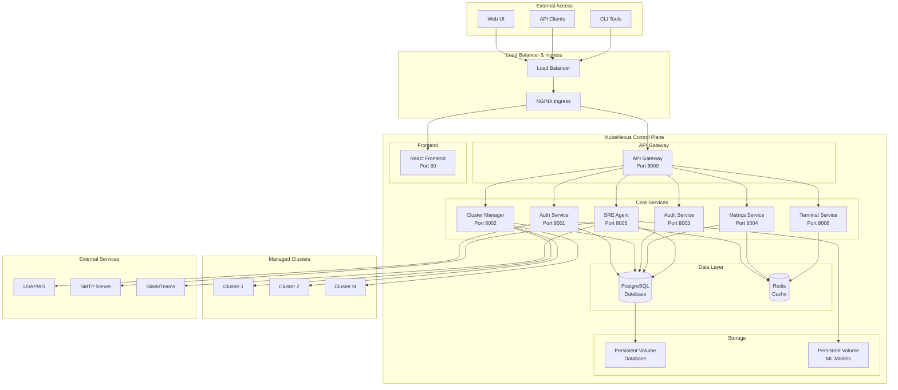
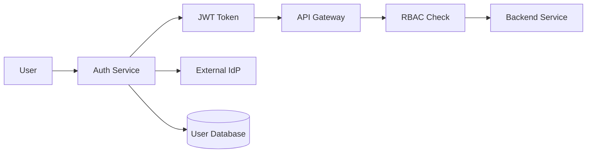
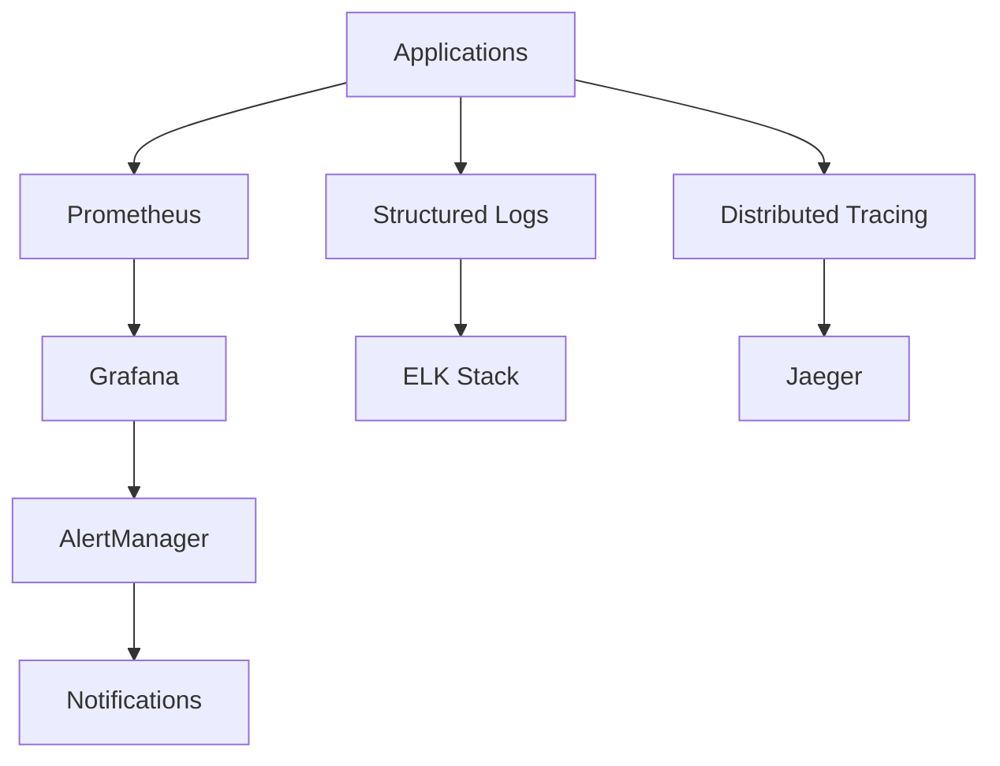
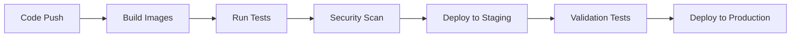

# KubeNexus Architecture

This document describes the high-level architecture, components, and design decisions of the KubeNexus platform.

## Overview

KubeNexus is a cloud-native platform built on microservices architecture, designed to provide enterprise-grade Kubernetes cluster management with AI-powered SRE capabilities.

## Core Components

### API Gateway (Port 8000)

**Purpose**: Central entry point for all API requests with routing, authentication, and rate limiting.

**Key Features**:
- Request routing to backend services
- JWT token validation
- Rate limiting and throttling
- Request/response logging
- CORS handling

**Technology Stack**:
- FastAPI (Python)
- Uvicorn ASGI server
- Redis for rate limiting

### Authentication Service (Port 8001)

**Purpose**: User authentication, authorization, and session management.

**Key Features**:
- User registration and login
- JWT token generation and validation
- Role-based access control (RBAC)
- Session management
- Integration with external identity providers

**Technology Stack**:
- FastAPI (Python)
- PostgreSQL for user data
- Redis for session storage
- bcrypt for password hashing

**Database Schema**:
- Users, roles, permissions
- User sessions and API keys
- Audit trails for auth events

### Cluster Manager Service (Port 8002)

**Purpose**: Kubernetes cluster lifecycle management and operations.

**Key Features**:
- Multi-cluster connectivity
- Kubeconfig management and encryption
- Resource deployment and management
- Cluster health monitoring
- RBAC integration with Kubernetes

**Technology Stack**:
- FastAPI (Python)
- Kubernetes Python client
- PostgreSQL for cluster metadata
- Encryption for sensitive data

**Key Operations**:
- Cluster registration and validation
- Resource CRUD operations
- Kubectl proxy functionality
- Cluster status monitoring

### SRE Agent Service (Port 8005)

**Purpose**: AI-powered site reliability engineering with anomaly detection and recommendations.

**Key Features**:
- Machine learning-based anomaly detection
- Automated problem identification
- Intelligent recommendations
- Performance analysis and insights
- Alert correlation and root cause analysis

**Technology Stack**:
- FastAPI (Python)
- scikit-learn for ML models
- PostgreSQL for data storage
- Persistent storage for ML models

**ML Pipeline**:
1. Data collection from clusters
2. Feature engineering and preprocessing
3. Anomaly detection using unsupervised learning
4. Pattern recognition and classification
5. Recommendation generation
6. Continuous model training and improvement

### Terminal Service (Port 8006)

**Purpose**: Web-based terminal access to Kubernetes clusters with kubectl functionality.

**Key Features**:
- WebSocket-based terminal sessions
- Secure kubectl proxy
- Session recording and audit
- Multi-cluster context switching

**Technology Stack**:
- FastAPI (Python)
- WebSocket support
- Kubernetes Python client
- Redis for session management

### Metrics Service (Port 8004)

**Purpose**: Metrics collection, aggregation, and monitoring for clusters and platform.

**Key Features**:
- Multi-cluster metrics aggregation
- Custom metric definitions
- Alerting and notification
- Performance dashboards
- Historical data analysis

**Technology Stack**:
- FastAPI (Python)
- PostgreSQL for metrics storage
- Redis for caching
- Integration with Prometheus/Grafana

### Audit Log Service (Port 8003)

**Purpose**: Comprehensive audit logging and compliance tracking.

**Key Features**:
- All user actions logging
- API request/response tracking
- Compliance reporting
- Log retention and archival
- Security event monitoring

**Technology Stack**:
- FastAPI (Python)
- PostgreSQL for audit storage
- Structured logging with correlation IDs

### Frontend (React SPA)

**Purpose**: Modern web interface for platform management.

**Key Features**:
- Responsive design with Bootstrap 5
- Real-time updates via WebSocket
- Multi-cluster dashboard
- Role-based UI components
- Integrated terminal access

**Technology Stack**:
- React with TypeScript
- Bootstrap 5 for styling
- WebSocket for real-time updates
- Chart.js for data visualization

## Data Architecture

### PostgreSQL Database

**Primary Storage**: Main database for persistent data storage.

**Key Tables**:
- **Users & Authentication**: User accounts, roles, sessions
- **Clusters**: Cluster metadata, configurations, status
- **Audit Logs**: Complete audit trail of all actions
- **SRE Data**: Problems, recommendations, ML training data
- **Metrics**: Performance and monitoring data

**Features**:
- ACID compliance for data integrity
- Indexing for performance optimization
- Backup and point-in-time recovery
- Connection pooling

### Redis Cache

**Purpose**: High-performance caching and session storage.

**Use Cases**:
- User session management
- Rate limiting counters
- Temporary data caching
- Real-time notifications
- WebSocket session tracking

**Features**:
- In-memory performance
- Pub/Sub for real-time updates
- TTL for automatic cleanup
- Persistence options

## Security Architecture

### Authentication & Authorization

**Multi-layered Security**:
1. **Transport Security**: HTTPS/TLS everywhere
2. **Authentication**: JWT tokens with RS256 signing
3. **Authorization**: Role-based access control
4. **Data Encryption**: Sensitive data encrypted at rest
5. **Network Security**: Service mesh and network policies

### Data Protection

- **Encryption at Rest**: Database encryption for sensitive data
- **Encryption in Transit**: TLS 1.3 for all communications
- **Secrets Management**: Kubernetes secrets for credentials
- **Key Rotation**: Regular rotation of encryption keys

## Scalability & Performance

### Horizontal Scaling

**Stateless Services**: All services designed for horizontal scaling

**Auto-scaling Targets**:
- API Gateway: 3-10 replicas
- Backend Services: 2-5 replicas per service
- Frontend: 3-5 replicas

### Performance Optimization

**Caching Strategy**:
- Redis for frequently accessed data
- Database query optimization
- CDN for static assets

**Database Performance**:
- Connection pooling
- Read replicas for analytics
- Indexing strategy for queries

### Load Distribution

**Traffic Patterns**:
- API Gateway handles all external traffic
- Internal service-to-service communication
- Database connection pooling

## High Availability

### Service Redundancy

- **Multi-replica Deployments**: All services run with multiple replicas
- **Health Checks**: Liveness and readiness probes
- **Circuit Breakers**: Failure isolation and recovery

### Data Availability

- **Database Replication**: PostgreSQL streaming replication
- **Backup Strategy**: Automated backups with point-in-time recovery
- **Redis Persistence**: RDB snapshots and AOF logging

### Disaster Recovery

- **Multi-region Deployment**: Active-passive setup
- **Data Replication**: Cross-region database replication
- **Automated Failover**: Health-based traffic routing

## Monitoring & Observability

### Metrics Collection

**Observability Stack**:
- **Metrics**: Prometheus + Grafana
- **Logging**: Structured JSON logs with correlation IDs
- **Tracing**: Distributed tracing with OpenTelemetry
- **Alerting**: PrometheusAlert + notification channels

### Health Monitoring

- **Service Health**: Health check endpoints
- **Database Health**: Connection and query monitoring
- **Cluster Health**: Kubernetes cluster metrics
- **Business Metrics**: Custom KPIs and SLAs

## Deployment Architecture

### Kubernetes Deployment

**Namespace Strategy**:
- Production: `kubenexus`
- Development: `kubenexus-dev`
- Staging: `kubenexus-staging`

**Resource Management**:
- Resource limits and requests for all pods
- Horizontal Pod Autoscaler (HPA)
- Vertical Pod Autoscaler (VPA)
- Cluster Autoscaler for node scaling

### CI/CD Pipeline

**Pipeline Stages**:
1. Code compilation and unit tests
2. Docker image building
3. Security scanning
4. Integration testing
5. Staging deployment
6. Production deployment with blue-green strategy

## Technology Decisions

### Language Choices

- **Backend**: Python (FastAPI) for rapid development and ML integration
- **Frontend**: TypeScript/React for type safety and modern UX
- **Infrastructure**: YAML/Kustomize for Kubernetes manifests

### Database Choices

- **PostgreSQL**: ACID compliance, JSON support, performance
- **Redis**: High-performance caching and session storage

### Framework Decisions

- **FastAPI**: Async support, automatic OpenAPI docs, type hints
- **React**: Component-based architecture, large ecosystem
- **Bootstrap**: Rapid UI development, responsive design

## Future Architecture Considerations

### Planned Enhancements

1. **Service Mesh**: Istio integration for advanced traffic management
2. **Event Sourcing**: Event-driven architecture for audit trail
3. **Multi-tenancy**: Tenant isolation and resource quotas
4. **Edge Computing**: Edge deployment capabilities
5. **Advanced ML**: Deep learning models for predictive analytics

### Scalability Roadmap

1. **Microservices Decomposition**: Further service breakdown
2. **Event-Driven Architecture**: Async communication patterns
3. **CQRS**: Command Query Responsibility Segregation
4. **Serverless Components**: Function-as-a-Service integration

---

**Last Updated**: 2024-01-01  
**Version**: 1.0.0  
**Authors**: KubeNexus Architecture Team 