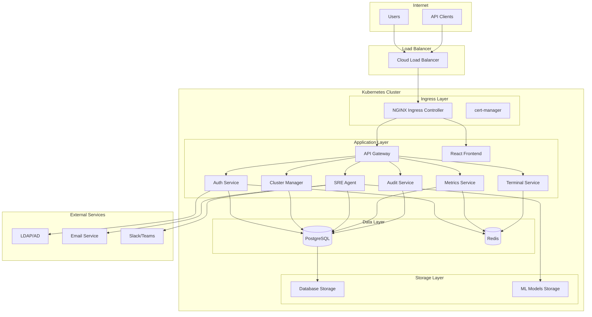

# KubeNexus Deployment Guide

This comprehensive deployment guide covers everything you need to know about deploying KubeNexus in production, development, and staging environments.

## Deployment Options

### [Production Deployment](production.md)
Complete guide for deploying KubeNexus in production environments with high availability, security, and scalability considerations.

### [Development Environment](development.md)
Set up local development environment with minikube for development and testing purposes.

### [Prerequisites](prerequisites.md)
System requirements, software dependencies, and infrastructure preparation needed before deployment.

### [Security Configuration](security.md)
Security hardening, best practices, and compliance configurations for production deployments.

### [Troubleshooting](troubleshooting.md)
Common deployment issues, diagnostic procedures, and resolution strategies.

## Quick Deployment

### One-Command Production Deployment

```bash
# Download and run deployment script
curl -sSL https://raw.githubusercontent.com/your-org/kubenexus/main/scripts/deploy-k8s.sh | bash -s -- --domain your-domain.com
```

### Prerequisites Check

Before deploying, ensure you have:

- Kubernetes cluster (1.24+) with admin access
- kubectl configured and connected
- Domain name with DNS control
- SSL certificate management (cert-manager will be installed)
- Persistent storage support

### Minimal Deployment

```bash
# Clone repository
git clone https://github.com/your-org/kubenexus.git
cd kubenexus

# Configure environment
export DOMAIN="kubenexus.yourdomain.com"

# Deploy with defaults
./scripts/deploy-k8s.sh --domain $DOMAIN
```

## Deployment Architecture



## Supported Platforms

### Cloud Providers

| Provider | Status | Documentation |
|----------|--------|---------------|
| **AWS EKS** | ✅ Fully Supported | [AWS Deployment Guide](production.md#aws-eks) |
| **Google GKE** | ✅ Fully Supported | [GCP Deployment Guide](production.md#google-gke) |
| **Azure AKS** | ✅ Fully Supported | [Azure Deployment Guide](production.md#azure-aks) |
| **DigitalOcean** | ✅ Supported | [DO Deployment Guide](production.md#digitalocean) |
| **Linode LKE** | ✅ Supported | [Linode Deployment Guide](production.md#linode-lke) |

### On-Premises

| Platform | Status | Notes |
|----------|--------|-------|
| **Bare Metal** | ✅ Supported | Requires manual load balancer setup |
| **VMware vSphere** | ✅ Supported | With vSphere CSI driver |
| **OpenStack** | ⚠️ Community | Community maintained |
| **Proxmox** | ⚠️ Community | Community maintained |

### Kubernetes Distributions

| Distribution | Version | Status |
|--------------|---------|--------|
| **Kubernetes** | 1.24+ | ✅ Fully Supported |
| **OpenShift** | 4.10+ | ✅ Supported |
| **Rancher** | 2.6+ | ✅ Supported |
| **k3s** | 1.24+ | ✅ Supported |
| **MicroK8s** | 1.24+ | ✅ Supported |

## Resource Requirements

### Minimum Requirements (Development)

- **Nodes**: 1 node
- **CPU**: 4 cores total
- **Memory**: 8GB total
- **Storage**: 20GB
- **Network**: Single availability zone

### Recommended Requirements (Production)

- **Nodes**: 3+ nodes
- **CPU**: 8 cores per node
- **Memory**: 16GB per node
- **Storage**: 100GB+ with high IOPS
- **Network**: Multi-AZ with load balancer

### Scaling Recommendations

| Clusters Managed | Nodes | CPU per Node | Memory per Node |
|-------------------|-------|--------------|-----------------|
| 1-5 | 3 | 4 cores | 8GB |
| 6-20 | 3 | 8 cores | 16GB |
| 21-50 | 5 | 8 cores | 32GB |
| 51+ | 7+ | 16 cores | 64GB |

## Deployment Scripts

### Available Scripts

| Script | Purpose | Usage |
|--------|---------|-------|
| `deploy-k8s.sh` | Production deployment | `./scripts/deploy-k8s.sh --domain example.com` |
| `build-images.sh` | Build Docker images | `./scripts/build-images.sh --tag v1.0.0` |
| `update-deployment.sh` | Update existing deployment | `./scripts/update-deployment.sh --new-tag v1.1.0` |
| `cleanup-k8s.sh` | Remove deployment | `./scripts/cleanup-k8s.sh` |
| `setup-dev-environment.sh` | Development setup | `./scripts/setup-dev-environment.sh` |

### Script Options

Common options across scripts:

```bash
# Domain configuration
--domain DOMAIN              # Primary domain
--api-domain DOMAIN          # API subdomain

# Image configuration
--registry REGISTRY          # Docker registry
--tag TAG                    # Image tag

# Deployment options
--skip-prerequisites         # Skip prerequisite installation
--skip-secrets-check        # Skip secrets validation
--dry-run                   # Show what would be deployed
--force                     # Skip confirmation prompts
```

## Configuration Management

### Environment Variables

```bash
# Core configuration
export DOMAIN="kubenexus.yourdomain.com"
export API_DOMAIN="api.kubenexus.yourdomain.com"

# Image configuration
export REGISTRY="your-registry.com/kubenexus"
export TAG="v1.0.0"

# Database configuration
export POSTGRES_PASSWORD="$(openssl rand -base64 32)"
export REDIS_PASSWORD="$(openssl rand -base64 32)"

# Security configuration
export JWT_SECRET_KEY="$(openssl rand -base64 64)"
export ENCRYPTION_KEY="$(openssl rand -base64 32)"
```

### Kustomize Configuration

KubeNexus uses Kustomize for configuration management:

```yaml
# k8s/kustomization.yaml
apiVersion: kustomize.config.k8s.io/v1beta1
kind: Kustomization

namespace: kubenexus

resources:
  - namespace.yaml
  - configmap.yaml
  - secrets.yaml
  # ... other resources

images:
  - name: kubenexus/auth-service
    newTag: v1.0.0
  # ... other images

patches:
  - target:
      kind: Deployment
      name: auth-service
    patch: |-
      - op: replace
        path: /spec/replicas
        value: 3
```

## Monitoring and Observability

### Built-in Monitoring

KubeNexus includes built-in monitoring capabilities:

- **Health Checks**: All services include health endpoints
- **Metrics**: Prometheus-compatible metrics
- **Logging**: Structured JSON logging
- **Tracing**: OpenTelemetry integration ready

### External Monitoring Integration

#### Prometheus and Grafana

```bash
# Add Prometheus monitoring
helm repo add prometheus-community https://prometheus-community.github.io/helm-charts
helm install monitoring prometheus-community/kube-prometheus-stack
```

#### ELK Stack

```bash
# Add Elasticsearch, Logstash, Kibana
helm repo add elastic https://helm.elastic.co
helm install logging elastic/elasticsearch
```

## Backup and Disaster Recovery

### Database Backup

```bash
# Automated backup script
./scripts/backup-database.sh

# Manual backup
kubectl exec -n kubenexus deployment/postgres -- pg_dumpall -U postgres > backup.sql
```

### Configuration Backup

```bash
# Backup all Kubernetes resources
kubectl get all,pvc,configmaps,secrets,ingress -n kubenexus -o yaml > kubenexus-backup.yaml
```

### Disaster Recovery

1. **Infrastructure**: Rebuild cluster infrastructure
2. **Storage**: Restore persistent volumes from snapshots
3. **Database**: Restore from database backups
4. **Configuration**: Apply backed-up Kubernetes resources
5. **Validation**: Verify all services are operational

## Security Considerations

### Network Security

- **TLS/SSL**: All traffic encrypted with TLS 1.3
- **Network Policies**: Restrict pod-to-pod communication
- **Ingress Security**: Rate limiting and DDoS protection
- **Service Mesh**: Consider Istio for advanced security

### Data Security

- **Encryption at Rest**: Database encryption enabled
- **Secrets Management**: Kubernetes secrets for credentials
- **Key Rotation**: Regular rotation of encryption keys
- **Audit Logging**: Complete audit trail of all actions

### Access Security

- **RBAC**: Role-based access control
- **Authentication**: Multi-factor authentication support
- **Authorization**: Fine-grained permissions
- **External IdP**: Integration with enterprise identity providers

## Performance Optimization

### Database Optimization

- **Connection Pooling**: Configure connection pools
- **Indexing**: Optimize database indexes
- **Read Replicas**: Scale read operations
- **Partitioning**: Table partitioning for large datasets

### Application Optimization

- **Caching**: Redis caching for frequently accessed data
- **CDN**: Content delivery network for static assets
- **Load Balancing**: Distribute traffic across replicas
- **Auto-scaling**: Horizontal pod autoscaling

### Infrastructure Optimization

- **Node Sizing**: Right-size compute resources
- **Storage**: High-performance storage for databases
- **Networking**: Optimize network bandwidth and latency
- **Monitoring**: Continuous performance monitoring

## Maintenance and Updates

### Regular Maintenance Tasks

- **Security Updates**: Apply security patches regularly
- **Certificate Renewal**: Monitor and renew SSL certificates
- **Backup Verification**: Test backup and restore procedures
- **Performance Review**: Monitor and optimize performance

### Update Procedures

```bash
# Update to new version
./scripts/update-deployment.sh --new-tag v1.1.0

# Rollback if needed
./scripts/update-deployment.sh --rollback

# Check deployment status
./scripts/update-deployment.sh --health-check-only
```

## Support and Troubleshooting

### Self-Service Resources

- **[Troubleshooting Guide](troubleshooting.md)**: Common issues and solutions
- **[FAQ](troubleshooting.md#faq)**: Frequently asked questions
- **Health Checks**: Built-in diagnostic tools
- **Logs**: Comprehensive logging for debugging

### Professional Support

- **Community Support**: GitHub issues and discussions
- **Enterprise Support**: Priority support with SLA
- **Professional Services**: Implementation assistance
- **Training**: Certification and training programs

---

**Next Steps**: Choose your deployment type and follow the detailed guides:
- **[Production Deployment](production.md)** for production environments
- **[Development Setup](development.md)** for local development
- **[Prerequisites](prerequisites.md)** to prepare your environment 